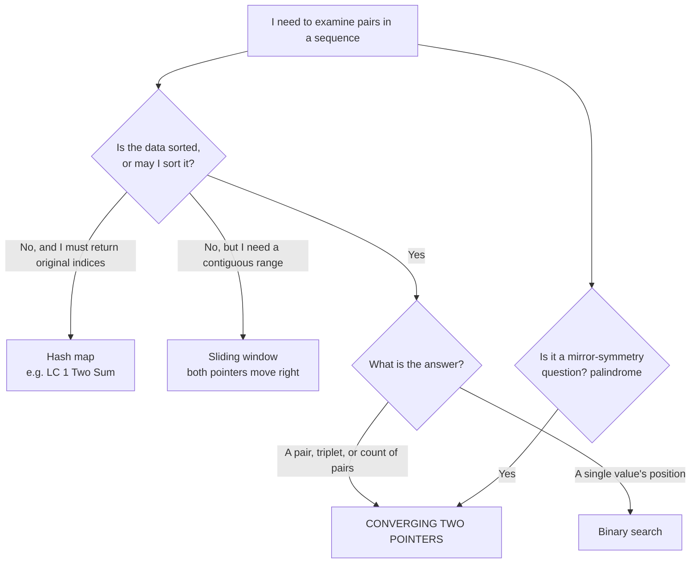

# 1.1 Two Pointers — Converging (opposite ends)

> Theory guide for the first block of `DSA_CURRICULUM.md` (Mon Aug 17 – Tue Aug 25).
> Read this **before** Day 1. Come back to it on every lock-in day.

**Block problems, in drill order:**

| # | Problem | Diff | Role in the block |
|---|---|---|---|
| 125 | Valid Palindrome | E | The purest form of the template |
| 977 | Squares of a Sorted Array | E | **Worked below** — pointers *build* output instead of searching |
| 2824 | Count Pairs Whose Sum is Less than Target | E | Counting instead of finding |
| 349 | Intersection of Two Arrays | E | Two pointers on **two different arrays** |
| 680 | Valid Palindrome II | E | The template + one branch |
| 167 | Two Sum II | M | Canonical sorted-pair search |
| 11 | Container With Most Water | M | **Worked below** — the correctness argument |
| 15 | 3Sum | M | **Worked below** — nesting + duplicate handling |
| 881 | Boats to Save People | M | Converging as a greedy pairing |

**Why I worked those three:** 977 teaches the version that surprises people (the pointers write output back-to-front, and the loop condition changes to `<=`). 11 is the one problem in this block where the greedy move looks like guessing — you need the actual proof or you'll never trust it. 15 is where the pattern nests inside a loop and where duplicate-skipping causes 90% of failed submissions. The other six are variations on those three ideas, so I've left them for you.

---

## 1. The one-sentence idea

**Put one pointer at each end of a sequence, and on every step throw away the end that provably cannot be part of a better answer — until the two pointers meet.**

That's it. The whole pattern is a search over pairs that would normally take O(n²), collapsed to O(n) because the ordering of the data tells you which end to discard.

```
        l →                                    ← r
       ┌───┬───┬───┬───┬───┬───┬───┬───┬───┐
       │   │   │   │   │   │   │   │   │   │
       └───┴───┴───┴───┴───┴───┴───┴───┴───┘
        ▲                                 ▲
        │                                 │
   still in play  ←── the window ──→  still in play

   Every step: examine (l, r), then eliminate one side.
   Window only shrinks → at most n steps.
```

### Pattern overview

Now the longer version of that same idea.

You start with one pointer at index `0` and one at the last index, and you walk them toward each other until they meet. What makes this more than a gimmick is the **decision at each step**: you look at the pair `(l, r)`, and the structure of the data tells you — with certainty, not a guess — which of the two ends can never appear in a better answer. You drop that one and move on. Because each step permanently eliminates one element, the whole thing finishes in a single pass.

The "structure" is almost always one of two things: the sequence is **sorted**, so moving `l` right can only increase a value and moving `r` left can only decrease it; or the question is about **mirror symmetry**, so position `i` from the front is only ever compared against position `i` from the back.

Four shapes cover essentially every converging problem you'll meet, and all four appear in this block:

| Shape | What the pointers are doing | Block problems |
|---|---|---|
| **Pair search on a sorted array** | Hunting for two values that hit a target or condition | 167, 2824, 881 |
| **Triplet search** | Freeze one element, pair-search the rest | 15 |
| **Mirror comparison** | Check front against back for symmetry | 125, 680 |
| **Merge from both ends** | Consume the extremes to *build* sorted output | 977 |
| **Max/min between two boundaries** | The answer *is* a pair of endpoints | 11 |

One outlier: **349 Intersection of Two Arrays** uses two pointers that both move **forward**, one per array. It isn't converging, but it drills the same "compare the fronts, advance the loser" reflex, so it lives in this block.

The payoff is the reason this is the first block in your curriculum: the obvious solution to all of these is a nested loop over every pair, which is **O(n²)**. Converging pointers collapse that to **O(n)** using **O(1)** extra space — no hash map, no second array. That n² → n collapse is one of the two or three most frequently tested ideas in entry-level interviews, and it shows up far beyond these nine problems.

---

## 2. Recognition triggers

**This is the section that matters.** In an interview nobody says "use two pointers." You get a paragraph of prose and 30 seconds to pick a direction.

### Phrases that scream converging two pointers

| Phrase in the problem | Why it points here |
|---|---|
| "sorted in **non-decreasing** order" | Sortedness is the property that makes discarding safe |
| "return the **indices of two numbers** such that…" | You're searching a pair, not a range |
| "find **two** / **a pair** / **i < j** such that…" | Pair search over a linear structure |
| "reads the **same forwards and backwards**" | Palindrome = compare mirrored positions |
| "**maximum area** / most water / widest…" between two boundaries | Answer is defined by two endpoints |
| "at most **two** per boat / per group" | Greedy pairing of lightest + heaviest |
| "**count the pairs** where…" | Same search, you accumulate instead of return |
| "the array may contain **negative** numbers" + already sorted | Extremes matter (this is 977's tell) |
| "**two sorted arrays**" — merge, intersect, compare | Two pointers, one per array |

### Constraints that hint at it

| Constraint | Read it as |
|---|---|
| Input is **already sorted** | The interviewer sorted it *for you*. That's not free — it's a hint. |
| "Can you do it in **O(n)**?" after an obvious O(n²) | Two pointers is the standard n² → n collapse |
| "**O(1) extra space**" / "in place" | Rules out the hash-map solution, leaves two pointers |
| "Can you do it **without sorting**?" (977) | You're being told the sorted order is already exploitable |
| n up to 10⁵ | O(n²) is ~10¹⁰ ops — too slow. O(n) or O(n log n) required. |
| n up to 3000 (15 3Sum) | O(n²) ≈ 9×10⁶ — **allowed**. Don't panic-optimize past it. |

### The 10-second self-check

> "If I sort this, does moving the **left** pointer right always make my quantity **bigger**, and moving the **right** pointer left always make it **smaller**?"

If yes → converging two pointers. That monotonic relationship is the entire engine. For 167 the quantity is the sum. For 11 it's the width. For 881 it's the combined weight.

### Decision flow



---

## 3. When it does NOT apply

This is where you'll actually lose points — the near-misses look identical at a glance.

| Looks like it, but isn't | Why | What it actually is |
|---|---|---|
| **LC 1 Two Sum** (unsorted, return indices) | Sorting destroys the original indices you must return | **Hash map**, `value → index`, one pass |
| **LC 3 Longest Substring Without Repeating Characters** | Answer is a *contiguous range*, not a pair of endpoints you can discard from | **Sliding window** + set |
| **LC 209 Minimum Size Subarray Sum** | Contiguous, and the left pointer only advances when the window is valid | **Sliding window** |
| **LC 560 Subarray Sum Equals K** (with negatives) | Negatives break monotonicity — growing the window can *shrink* the sum | **Prefix sum + hash map** |
| **LC 26 / 27 / 283** (remove dupes, move zeroes) | Both pointers move **left→right**; one reads, one writes | **Reader/writer pointers** — sub-pattern **1.4**, In-place Modification |
| **LC 141 / 142 / 876 / 287** (cycles, middle of list) | Same direction, one pointer moves **twice as fast**; they meet iff there's a cycle | **Fast & slow** ("tortoise and hare") — sub-pattern **1.2** |
| **LC 704 Binary Search** | You're locating one value, not pairing two | **Binary search** |
| "Find the k-th smallest" | Not a pair problem | Heap or binary search |
| Any problem where **output order must match input order** | Sorting is off the table, so the monotone property never exists | Hash map |

### The single distinction that trips people up

```
CONVERGING (this block)          SLIDING WINDOW (block 3)
l →              ← r             l →     r →
└──── shrinks ────┘              └─ grows/shrinks ─┘

Pointers move TOWARD each other  Both move in the SAME direction
Answer = a PAIR of positions     Answer = a CONTIGUOUS RANGE
Each element seen ~once          Each element seen ~twice
Needs sorted / symmetric data    Needs a monotone window condition
```

**Rule of thumb:** if the words "subarray" or "substring" appear, you're probably in sliding-window territory, not here. Exception: 977, where the *output* is built from both ends.

---

## 4. The template

You should be able to hand-write this cold by Aug 25.

```python
def converging(nums):
    l, r = 0, len(nums) - 1     # start at the two ends
    result = ...                # accumulator: best value, list, count, bool

    while l < r:                # `<` = need TWO distinct indices
        # 1. Evaluate the current pair
        current = combine(nums[l], nums[r])

        # 2. Record it if it matters
        result = update(result, current)

        # 3. Discard the end that cannot improve the answer
        if too_small(current):
            l += 1              # need a bigger contribution → move left up
        else:
            r -= 1              # need a smaller contribution → move right down

    return result
```

### The three knobs you turn per problem

| Knob | Options you'll see in this block |
|---|---|
| **Loop condition** | `l < r` when you need a *pair* (125, 167, 11, 15, 881, 2824)<br/>`l <= r` when *every index must be processed*, including the middle one (977) |
| **What you record** | a boolean (125, 680), a max (11), a list (15), a count (2824, 881), a written slot (977) |
| **Which pointer moves** | driven by a comparison that must be **monotone** — see §6 |

### The one non-negotiable

**Every iteration must move at least one pointer.** If a branch can leave both `l` and `r` unchanged, you have an infinite loop. Check this before you hit submit, every time.

### Memory hooks

Two things to burn in so you never have to re-derive which pointer moves.

> **"Left for Less, Right for Reduce."**
>
> Sum came out **less** than the target → move **left** up. Need to **reduce** the sum → move **right** down.

And the picture to hold in your head:

> Two people start at opposite ends of a hallway and walk toward each other. Each time they stop, they compare what they're holding and **one of them steps forward and drops out**. They always meet in the middle, and nobody walks the hallway twice.

That image is doing real work: "one of them drops out each step" is why it's O(n), and "nobody walks it twice" is why it's O(1) space.

---

## 5. Visual traces

### 5a. Worked problem — 977. Squares of a Sorted Array (Easy)

```
Given an integer array nums sorted in non-decreasing order, return an array of
the squares of each number sorted in non-decreasing order.

---
A simpler way to say it:
    • You get a sorted list that may contain negatives.
    • Square every number.
    • Return the squares, still sorted.

    The catch:
      Squaring destroys the sort order, because -4 squared (16) is bigger
      than 3 squared (9). So you can't just square in place and return.

Example 1:
    Input:  nums = [-4, -1, 0, 3, 10]
    Output: [0, 1, 9, 16, 100]
    Explanation: squares are [16, 1, 0, 9, 100]; sorted they become [0,1,9,16,100].

Example 2:
    Input:  nums = [-7, -3, 2, 3, 11]
    Output: [4, 9, 9, 49, 121]

Constraints:
    1 <= nums.length <= 10^4
    -10^4 <= nums[i] <= 10^4
    nums is sorted in non-decreasing order.

Follow-up: can you do it in O(n) without sorting?
```

**The one insight:** in a sorted array, the **largest square is always at one of the two ends** — either the most negative number on the left, or the most positive on the right. It's never in the middle. So instead of finding the smallest square first (which would require hunting for where the array crosses zero), find the **largest** each step and fill the output **back to front**.

#### Clean solution

```python
def sorted_squares(nums):
    n = len(nums)
    result = [0] * n
    l, r = 0, n - 1
    write = n - 1

    while l <= r:
        left_sq = nums[l] * nums[l]
        right_sq = nums[r] * nums[r]

        if left_sq > right_sq:
            result[write] = left_sq
            l += 1
        else:
            result[write] = right_sq
            r -= 1

        write -= 1

    return result


nums = [-4, -1, 0, 3, 10]
print(sorted_squares(nums))
# Output: [0, 1, 9, 16, 100] → largest square taken from an end each step, written back to front
```

#### Breakdown

```python
def sorted_squares(nums):

    # Step 1: Pre-size the output so we can write into any slot
    n = len(nums)
    result = [0] * n              # Same length as input; we overwrite every slot

    # Step 2: One pointer per end, plus a write cursor at the BACK
    l, r = 0, n - 1               # l = most negative candidate, r = most positive
    write = n - 1                 # We fill largest-first, so start at the last index

    # Step 3: Take the bigger square from whichever end has it
    while l <= r:                 # `<=` because the middle element still needs writing
        left_sq = nums[l] * nums[l]
        right_sq = nums[r] * nums[r]

        if left_sq > right_sq:    # Left end wins → it's the largest remaining square
            result[write] = left_sq
            l += 1                # That element is consumed; shrink from the left
        else:                     # Right end wins (ties go right — either is fine)
            result[write] = right_sq
            r -= 1                # Consumed; shrink from the right

        write -= 1                # Next-largest goes one slot earlier

    return result                 # Filled back-to-front, so it comes out ascending
```

#### Trace — `nums = [-4, -1, 0, 3, 10]`

```
Start:  result = [_, _, _, _, _]     l = 0   r = 4   write = 4

index:     0     1     2     3     4
nums:    [-4,   -1,    0,    3,   10]
           ▲                        ▲
           l                        r
```

| Step | l | r | nums[l] | nums[r] | left_sq | right_sq | Bigger | Write | result after | Move |
|---|---|---|---|---|---|---|---|---|---|---|
| 1 | 0 | 4 | -4 | 10 | 16 | **100** | right | `result[4]=100` | `[_, _, _, _, 100]` | `r → 3` |
| 2 | 0 | 3 | -4 | 3 | **16** | 9 | left | `result[3]=16` | `[_, _, _, 16, 100]` | `l → 1` |
| 3 | 1 | 3 | -1 | 3 | 1 | **9** | right | `result[2]=9` | `[_, _, 9, 16, 100]` | `r → 2` |
| 4 | 1 | 2 | -1 | 0 | **1** | 0 | left | `result[1]=1` | `[_, 1, 9, 16, 100]` | `l → 2` |
| 5 | 2 | 2 | 0 | 0 | 0 | 0 | tie→right | `result[0]=0` | `[0, 1, 9, 16, 100]` | `r → 1` |
| — | 2 | 1 | — | — | — | — | — | — | `l > r` → **exit** | |

**Return `[0, 1, 9, 16, 100]`** ✓

**Look at step 5.** `l == r == 2` — the two pointers are on the same element. If the loop said `while l < r`, this step never runs and `result[0]` stays `0` by luck here, but would be **wrong** for `nums = [1, 2, 3]` (you'd return `[0, 4, 9]` instead of `[1, 4, 9]`). That's the whole reason 977 uses `<=`.

```
Time: O(N)
  - Let N = len(nums).
  - Each iteration consumes exactly one element (l moves up or r moves down).
  - The gap r - l starts at N-1 and strictly decreases → at most N iterations.
  - Work per iteration: two multiplications, one comparison, one write → all O(1).
  - Overall: O(N). Beats the square-then-sort approach at O(N log N).

Space: O(N) for the output, O(1) auxiliary
  - result holds N integers — but it's the required return value, not scratch space.
  - l, r, write, left_sq, right_sq are scalars → O(1).
  - Interview convention: "O(1) extra space, not counting the output."


Interview Answer: Worst Case

Time: O(N)
  - Single pass; each element is consumed exactly once.

Space: O(N)
  - The output array. O(1) auxiliary beyond it.
```

---

### 5b. Worked problem — 11. Container With Most Water (Medium)

```
You are given an integer array height of length n. There are n vertical lines
drawn such that the two endpoints of the i-th line are (i, 0) and (i, height[i]).

Find two lines that together with the x-axis form a container, such that the
container contains the most water. Return the maximum amount of water it can store.

You may not slant the container.

---
A simpler way to say it:
    • Each number is the height of a wall standing on a number line.
    • Pick any two walls. Water fills the space between them.
    • Water level is capped by the SHORTER wall — otherwise it spills over.
    • Area = (distance between the walls) × (height of the shorter wall)
    • Return the largest area possible.

Example 1:
    Input:  height = [1, 8, 6, 2, 5, 4, 8, 3, 7]
    Output: 49
    Explanation: walls at index 1 (height 8) and index 8 (height 7).
                 Width = 8 - 1 = 7, height = min(8, 7) = 7 → 7 × 7 = 49.

Example 2:
    Input:  height = [1, 1]
    Output: 1

Constraints:
    n == height.length
    2 <= n <= 10^5
    0 <= height[i] <= 10^4
```

**Why n ≤ 10⁵ matters:** the brute force checks all pairs — 10⁵ choose 2 ≈ 5×10⁹ operations. Way too slow. The constraint is telling you O(n) is required.

#### Clean solution

```python
def max_area(height):
    l, r = 0, len(height) - 1
    best = 0

    while l < r:
        area = min(height[l], height[r]) * (r - l)
        best = max(best, area)

        if height[l] < height[r]:
            l += 1
        else:
            r -= 1

    return best


height = [1, 8, 6, 2, 5, 4, 8, 3, 7]
print(max_area(height))
# Output: 49 → start at the widest pair, always retreat from the shorter wall
```

#### Breakdown

```python
def max_area(height):

    # Step 1: Start with the WIDEST possible container
    l, r = 0, len(height) - 1     # Nothing can ever be wider than this
    best = 0                      # Best area seen so far

    # Step 2: Measure, record, then discard the limiting wall
    while l < r:                  # `<` because a container needs two DIFFERENT walls

        area = min(height[l], height[r]) * (r - l)
        #       ^^^^^^^^^^^^^^^^^^^^^^^^   ^^^^^^^
        #       water level = shorter wall  width = index distance (NOT +1)

        best = max(best, area)    # Keep the running maximum

        # Step 3: Move the SHORTER wall inward
        if height[l] < height[r]:
            l += 1                # Left is the bottleneck → it can never help again
        else:
            r -= 1                # Right is the bottleneck (or a tie) → drop it

    return best
```

#### Trace — `height = [1, 8, 6, 2, 5, 4, 8, 3, 7]`

```
index:    0    1    2    3    4    5    6    7    8
height: [ 1,   8,   6,   2,   5,   4,   8,   3,   7 ]

                  8 █              8 █
                    █                █         7 █
                    █    6 █         █           █
                    █      █    5 █  █           █
                    █      █      █  █ 4 █       █
                    █      █      █  █   █  3 █  █
              1 █   █      █ 2 █  █  █   █    █  █
              ─┴────┴──────┴────┴──┴──┴───┴────┴──┴──
               0    1      2    3  4  5   6    7  8
```

| Step | l | r | h[l] | h[r] | Width `r-l` | Level `min` | Area | best | Shorter side | Move |
|---|---|---|---|---|---|---|---|---|---|---|
| 1 | 0 | 8 | **1** | 7 | 8 | 1 | 8 | 8 | left | `l → 1` |
| 2 | 1 | 8 | 8 | **7** | 7 | 7 | **49** | **49** | right | `r → 7` |
| 3 | 1 | 7 | 8 | **3** | 6 | 3 | 18 | 49 | right | `r → 6` |
| 4 | 1 | 6 | 8 | 8 | 5 | 8 | 40 | 49 | tie | `r → 5` |
| 5 | 1 | 5 | 8 | **4** | 4 | 4 | 16 | 49 | right | `r → 4` |
| 6 | 1 | 4 | 8 | **5** | 3 | 5 | 15 | 49 | right | `r → 3` |
| 7 | 1 | 3 | 8 | **2** | 2 | 2 | 4 | 49 | right | `r → 2` |
| 8 | 1 | 2 | 8 | **6** | 1 | 6 | 6 | 49 | right | `r → 1` |
| — | 1 | 1 | — | — | — | — | — | — | `l < r` false → **exit** | |

**Return `49`** ✓

Notice how the max was found at step 2 and the algorithm spent six more steps confirming nothing beats it. That's fine — it's still one pass.

```
Time: O(N)
  - Let N = len(height).
  - Each iteration moves exactly one pointer inward, so the gap r - l shrinks by 1.
  - The gap starts at N-1 and the loop stops at 0 → exactly N-1 iterations.
  - Work per iteration: one min, one multiply, one max, one compare → O(1).
  - Overall: O(N). Brute force over all pairs would be O(N²).

Space: O(1)
  - Only l, r, best, area → four scalars, independent of N.
  - No extra array, no hash map.
  - Overall: O(1).


Interview Answer: Worst Case

Time: O(N)
  - One pass; pointers together traverse the array once.

Space: O(1)
  - Constant extra space — just two indices and a running max.
```

---

### 5c. Worked problem — 15. 3Sum (Medium)

```
Given an integer array nums, return all the triplets [nums[i], nums[j], nums[k]]
such that i != j, i != k, j != k, and nums[i] + nums[j] + nums[k] == 0.

Notice that the solution set must not contain duplicate triplets.

---
A simpler way to say it:
    • Find every group of three numbers that add up to zero.
    • Use each array position at most once per triplet.
    • Don't return the same triplet twice, even if it can be formed from
      different positions. [-1, 0, 1] appearing twice is one answer, not two.

Example 1:
    Input:  nums = [-1, 0, 1, 2, -1, -4]
    Output: [[-1, -1, 2], [-1, 0, 1]]
    Explanation: -1 + -1 + 2 = 0 and -1 + 0 + 1 = 0.
                 [-1, 0, 1] can be formed two ways, but appears once in the output.

Example 2:
    Input:  nums = [0, 1, 1]
    Output: []

Example 3:
    Input:  nums = [0, 0, 0]
    Output: [[0, 0, 0]]

Constraints:
    3 <= nums.length <= 3000
    -10^5 <= nums[i] <= 10^5
```

**The one insight:** 3Sum is just **2Sum-on-a-sorted-array, run n times**. Freeze one number `nums[i]`; now you need two more numbers summing to `-nums[i]`, which is exactly problem 167. Sorting is what makes the two-pointer part work, and it's *also* what makes duplicate-skipping easy — identical values end up adjacent.

**Why n ≤ 3000 matters:** O(n²) is ~9 million operations. That's comfortably fast. Don't try to beat it.

#### Clean solution

```python
def three_sum(nums):
    nums.sort()
    n = len(nums)
    res = []

    for i in range(n - 2):
        if nums[i] > 0:
            break
        if i > 0 and nums[i] == nums[i - 1]:
            continue

        l, r = i + 1, n - 1

        while l < r:
            total = nums[i] + nums[l] + nums[r]

            if total < 0:
                l += 1
            elif total > 0:
                r -= 1
            else:
                res.append([nums[i], nums[l], nums[r]])
                l += 1
                r -= 1
                while l < r and nums[l] == nums[l - 1]:
                    l += 1
                while l < r and nums[r] == nums[r + 1]:
                    r -= 1

    return res


nums = [-1, 0, 1, 2, -1, -4]
print(three_sum(nums))
# Output: [[-1, -1, 2], [-1, 0, 1]] → sort, fix i, two-pointer the rest, skip duplicates
```

#### Breakdown

```python
def three_sum(nums):

    # Step 1: Sort — this is what unlocks both the two-pointer move and dedup
    nums.sort()                            # Duplicates become adjacent
    n = len(nums)
    res = []

    # Step 2: Fix the first number of the triplet
    for i in range(n - 2):                 # Stop at n-3; need room for l and r

        if nums[i] > 0:
            break                          # Sorted, so all three would be positive
                                           # → sum can never be 0. Done entirely.

        if i > 0 and nums[i] == nums[i - 1]:
            continue                       # Same first number as last round →
                                           # would regenerate identical triplets.
                                           # `i > 0` guard: i-1 must exist.

        # Step 3: Two-pointer 2Sum on everything to the RIGHT of i
        l, r = i + 1, n - 1                # l starts after i → guarantees i < l < r

        while l < r:
            total = nums[i] + nums[l] + nums[r]

            if total < 0:
                l += 1                     # Too small → need a bigger number
            elif total > 0:
                r -= 1                     # Too big → need a smaller number
            else:
                res.append([nums[i], nums[l], nums[r]])

                l += 1                     # Move BOTH: with i and l fixed, r is
                r -= 1                     # unique, so neither alone can help

                # Step 4: Skip repeats of the value we just used
                while l < r and nums[l] == nums[l - 1]:
                    l += 1                 # Same left value → same triplet again
                while l < r and nums[r] == nums[r + 1]:
                    r -= 1                 # Same right value → same triplet again

    return res
```

#### Trace — `nums = [-1, 0, 1, 2, -1, -4]`

**After `nums.sort()`:**

```
index:    0     1     2     3     4     5
nums:  [ -4,   -1,   -1,    0,    1,    2 ]
```

**Outer loop `i = 0` → fixed value `-4`, target for the pair = `4`**

| l | r | nums[l] | nums[r] | total | Verdict | Move |
|---|---|---|---|---|---|---|
| 1 | 5 | -1 | 2 | -3 | < 0 | `l → 2` |
| 2 | 5 | -1 | 2 | -3 | < 0 | `l → 3` |
| 3 | 5 | 0 | 2 | -2 | < 0 | `l → 4` |
| 4 | 5 | 1 | 2 | -1 | < 0 | `l → 5` |
| 5 | 5 | — | — | — | `l < r` false | **exit** |

Nothing found. `-4` is too negative to be rescued.

**Outer loop `i = 1` → fixed value `-1`** (dedup check: `nums[1] == nums[0]`? `-1 == -4` → no, proceed)

```
        i           l                    r
index:  0     1     2     3     4     5
nums: [-4,   -1,   -1,    0,    1,    2 ]
              ▲     ▲                  ▲
            fixed
```

| l | r | nums[l] | nums[r] | total | Verdict | Action |
|---|---|---|---|---|---|---|
| 2 | 5 | -1 | 2 | **0** | **HIT** | record `[-1, -1, 2]`, then `l → 3`, `r → 4` |
| | | | | | dedup L | `nums[3]==nums[2]`? `0 == -1` no → stay |
| | | | | | dedup R | `nums[4]==nums[5]`? `1 == 2` no → stay |
| 3 | 4 | 0 | 1 | **0** | **HIT** | record `[-1, 0, 1]`, then `l → 4`, `r → 3` |
| | | | | | dedup | `l < r` false → both skips no-op |
| 4 | 3 | — | — | — | `l < r` false | **exit** |

**Outer loop `i = 2` → value `-1`.** Dedup check: `i > 0` ✓ and `nums[2] == nums[1]` → `-1 == -1` ✓ → **`continue`, skipped entirely.**

This is the dedup rule earning its keep. Without it, `i = 2` would re-derive `[-1, 0, 1]` and you'd return it twice.

**Outer loop `i = 3` → value `0`.** Not `> 0`, and `nums[3] != nums[2]`.

| l | r | nums[l] | nums[r] | total | Verdict | Move |
|---|---|---|---|---|---|---|
| 4 | 5 | 1 | 2 | 3 | > 0 | `r → 4` |
| 4 | 4 | — | — | — | `l < r` false | **exit** |

Loop ends (`range(n-2)` = `range(4)`, so `i` stops at 3).

**Return `[[-1, -1, 2], [-1, 0, 1]]`** ✓

```
Time: O(N²)
  - Let N = len(nums).

  - Step 1: nums.sort() → O(N log N).

  - Step 2: Outer loop runs at most N times.
  - Step 3: For each i, the inner while runs at most N times, because l starts at
    i+1, r starts at N-1, and every branch moves at least one of them inward.
      • The dedup while-loops don't add a new pass — they advance the SAME
        pointers the outer while would advance anyway. Amortized, still O(N).
  - Nested: O(N) × O(N) = O(N²).

  - Overall: O(N log N) + O(N²) = O(N²), since N² dominates N log N.

Space: O(1) auxiliary, or O(N) counting the sort
  - res holds the output — not counted as auxiliary.
  - Python's sort (Timsort) uses O(N) in the worst case internally.
  - The pointers i, l, r, total are scalars → O(1).
  - Interview answer: "O(1) extra, ignoring the output and the sort's internals."


Interview Answer: Worst Case

Time: O(N²)
  - Sort is O(N log N), then one two-pointer pass per fixed element → N²,
    which dominates.

Space: O(1)
  - Constant extra beyond the output array (and whatever the sort uses).
```

---

## 6. Why it's correct

Every converging two-pointer solution rests on one **invariant**:

> **At the start of each iteration, if a valid answer exists at all, at least one valid answer uses only indices in `[l, r]`.**

You maintain that invariant by only ever discarding an index you can **prove** is useless. Here's the proof for each shape you'll meet in this block.

### Case A — sum-based (167, 2824, 15's inner loop, 881)

Array is sorted ascending. Current pair is `(l, r)`.

**If `nums[l] + nums[r] > target`:** we discard `r`. Is that safe? Every remaining index `j` satisfies `l ≤ j` and therefore `nums[j] ≥ nums[l]`. So for any pair `(j, r)` still in the window:

```
nums[j] + nums[r]  ≥  nums[l] + nums[r]  >  target
```

Every pair that uses `r` overshoots. **`r` cannot be part of any answer.** Discard it. ∎

**If `nums[l] + nums[r] < target`:** symmetric. Every `j ≤ r` has `nums[j] ≤ nums[r]`, so every pair using `l` undershoots. Discard `l`. ∎

The engine is **monotonicity**: `l += 1` can only increase the sum, `r -= 1` can only decrease it. Break the sort and this argument evaporates — which is exactly why LC 1 (unsorted, index-preserving) needs a hash map instead.

### Case B — symmetry-based (125, 680)

A string is a palindrome iff `s[i] == s[n-1-i]` for all `i`. Comparing from the outside in checks exactly those pairs, each once. If any mismatch is found, the string fails by definition. If the pointers meet with no mismatch, every mirrored pair matched. ∎

### Case C — 11 Container With Most Water (the one that needs a real argument)

This is the one people accept on faith and then can't reproduce. Here's the actual proof.

**Setup.** Current pointers `l, r`. Suppose `height[l] ≤ height[r]`, so we're about to do `l += 1` — permanently discarding index `l`. We must show: **no pair using index `l` beats the area we already recorded.**

The pairs using `l` that we'd be throwing away are `(l, j)` for every `j` with `l < j < r`. (Pairs `(l, j)` with `j > r` are already gone from earlier steps, by induction.)

**Bound the height:**

```
level(l, j) = min(height[l], height[j])  ≤  height[l]
```

By definition, `min` of anything with `height[l]` is at most `height[l]`.

**Bound the width:**

```
width(l, j) = j - l  <  r - l
```

Because `j < r`.

**Multiply:**

```
Area(l, j) = level(l, j) × width(l, j)
           ≤ height[l]  × (j - l)
           <  height[l]  × (r - l)
           =  min(height[l], height[r]) × (r - l)     ← since height[l] ≤ height[r]
           =  Area(l, r)                              ← ALREADY RECORDED
```

**Conclusion:** every discarded pair is *strictly worse* than the pair we just measured. Discarding `l` costs nothing. ∎ (Symmetric when `height[r] < height[l]`.)

**Why you can't move the taller wall instead:** moving the taller pointer inward reduces the width by 1 and **cannot raise the water level**, because the level is still capped by the shorter wall, which hasn't moved. So the area can only shrink or stay flat. You'd be paying width for nothing.

```
   Move the SHORTER wall            Move the TALLER wall
   ─────────────────────            ────────────────────
   width  ↓ by 1                    width  ↓ by 1
   level  MAY go up ↑               level  capped by the same short wall → ↔
   → could improve                  → can only get worse
```

### Case D — 977 (a merge, not a search)

The array is sorted ascending, so `|nums[i]|` is **decreasing** on the left half and **increasing** on the right half — a valley shape. The maximum absolute value therefore always sits at index `l` or index `r`. Taking the larger of the two ends and writing it at position `write` places the true k-th-largest square at the correct slot. Repeating produces descending values into descending slots → an ascending output. ∎

### Termination (why the loop always ends)

Every iteration moves at least one pointer inward, so `r - l` strictly decreases. It starts at `n - 1` and is bounded below by 0. It must reach the exit condition in at most `n` steps. This is also the whole O(n) argument — see §7.

---

## 7. Complexity

### Time

The argument is always the same, and it's worth memorizing as a sentence:

> "The gap `r - l` starts at `n - 1`, decreases by at least 1 every iteration, and the loop stops when it hits 0. So the loop body runs at most `n` times, and each body is O(1) work — **O(n) total**."

| Problem | Time | Where it comes from |
|---|---|---|
| 125 Valid Palindrome | O(n) | One converging pass |
| 977 Squares | O(n) | One pass, beats square-then-sort's O(n log n) |
| 2824 Count Pairs | O(n log n) | **Sort dominates** the O(n) pass |
| 349 Intersection | O(n log n + m log m) | Sort both, then a linear merge |
| 680 Valid Palindrome II | O(n) | One pass + at most two O(n) verifications = 3n → O(n) |
| 167 Two Sum II | O(n) | Input arrives sorted, so no sort cost |
| 11 Container | O(n) | Exactly n-1 iterations |
| 15 3Sum | O(n²) | O(n log n) sort + n outer × O(n) inner; n² dominates |
| 881 Boats | O(n log n) | Sort dominates |

**The trap:** if you sort the input yourself, your answer is **O(n log n)**, not O(n). Saying "O(n)" for 2824 or 881 is a real mistake an interviewer will catch. Only claim O(n) when the input is *given* sorted (167) or when no sort is needed (125, 977, 11).

**Why 3Sum's dedup loops don't add complexity:** the inner `while nums[l] == nums[l-1]: l += 1` looks like a nested loop, but it advances `l` — the same pointer the outer `while` advances. Across the entire inner pass, `l` and `r` collectively move at most `n` positions total, no matter how the moves are split between the main branches and the dedup skips. That's an **amortized** argument, and it's a good thing to say out loud.

### Space

| What | Cost |
|---|---|
| The pointers themselves (`l`, `r`, `write`, `i`) | O(1) — always |
| A running max / count / boolean | O(1) |
| The output array (977's `result`, 15's `res`, 349's set) | O(n) — but **conventionally excluded** |
| Timsort's internals when you call `.sort()` | O(n) worst case |
| 125 if you build a cleaned string first | O(n) — the in-place two-pointer version avoids this |

**How to phrase it:** "O(1) auxiliary space, not counting the output." That's the standard convention and it signals you know the distinction.

---

## 8. Common bugs

Read this list the night before each of the nine problems. These are the specific ways this pattern breaks.

### Loop condition

| Bug | Symptom | Fix |
|---|---|---|
| `while l < r` when every element must be processed | 977 drops the middle element on odd-length input | Use `l <= r` when the middle index still needs handling |
| `while l <= r` when you need a *pair* | Pairs an element with itself; 167 returns `[i, i]` | Use `l < r` for pair problems |
| A branch that moves neither pointer | Infinite loop / TLE | Every branch must move `l` or `r`. Verify before submitting. |
| `while l != r` | Skips past each other on a two-step move and never terminates | Use `<` or `<=` — never `!=` |

### Off-by-one

| Bug | Where | Correct form |
|---|---|---|
| `r = len(nums)` | Everywhere | `r = len(nums) - 1` |
| Width computed as `r - l + 1` | 11 | Width is `r - l`. `+1` is for *counting elements*, not measuring distance between them. |
| Returning 0-indexed positions | 167 | 167 is **1-indexed** → return `[l + 1, r + 1]` |
| `for i in range(n)` in the outer loop | 15 | `range(n - 2)` — you need room for `l` and `r` after `i` |
| `l = i` instead of `l = i + 1` | 15 | `l = i + 1`, or you'll reuse `nums[i]` twice in one triplet |

### Edge cases to test by hand before submitting

| Input | What to check |
|---|---|
| `[]` (empty) | `r = -1`, so `while l < r` is immediately false → returns the default. Confirm the default is right. |
| `[5]` (single) | `l == r == 0` → `l < r` false. But `l <= r` runs once — make sure that's what you want. |
| `[1, 2]` (exactly two) | The minimum real case. Exactly one iteration. |
| `[3, 3, 3, 3]` (all identical) | Exercises every dedup branch at once |
| Even vs odd length | Even: pointers cross without meeting. Odd: they land on the same index. 977 needs the odd case handled. |
| All negatives (977) | The left end supplies the largest squares the whole way through |
| `" "` (125) | Empty after filtering → is `True` |

### Problem-specific traps

**125 Valid Palindrome** — you need *two inner while loops* to skip non-alphanumerics, one per pointer, and both need the `l < r` guard or they run off the end on a string like `",."`. Use `.isalnum()` and `.lower()`.

**977** — comparing `nums[l] < nums[r]` instead of the squares (or absolute values). With `[-4, 3]`, `-4 < 3` is true but `16 > 9`. Compare magnitudes, always.

**680 Valid Palindrome II** — on a mismatch you must test **both** options: skip the left character *or* skip the right. Testing only one fails on inputs like `"cupuu"`. Write a small `is_palindrome(s, i, j)` helper and call it twice.

**167** — the 1-indexed return. Also don't reach for a hash map here; using O(n) space on a pre-sorted array is the exact thing the problem is testing you *not* to do.

**11** — don't sort. Sorting destroys the positions, and the positions *are* the width.

**15 3Sum — the duplicate logic, in detail.** Three separate skips, and they are not interchangeable:

```python
# 1. OUTER dedup — before starting the inner pass
if i > 0 and nums[i] == nums[i - 1]:
    continue
#   ^^^^^ the `i > 0` guard is mandatory: at i == 0 there is no nums[-1]
#         (well, Python wraps to the LAST element — a silent, nasty bug)

# 2 & 3. INNER dedup — AFTER recording a hit and AFTER moving both pointers
l += 1
r -= 1
while l < r and nums[l] == nums[l - 1]:
    l += 1
while l < r and nums[r] == nums[r + 1]:
    r -= 1
#     ^^^^^ the `l < r` guard is mandatory or you index out of bounds
```

- **Outer skip:** compare **backward** (`nums[i] == nums[i-1]`) to keep the *first* occurrence and skip the rest. Comparing forward (`nums[i] == nums[i+1]`) skips the first and keeps the last — which drops valid triplets like `[0,0,0]`.
- **Inner skips:** in the form written above, they must come **after** `l += 1; r -= 1`. The comparison is backward (`nums[l] == nums[l-1]`), so it's asking "did I just land on a repeat of the value I used?" — a question that only makes sense once you've moved.
- On a hit you must move **both** pointers. Moving only `l` guarantees the next `total` is too large, and moving only `r` guarantees too small — you'd just bounce.

**You will see a different-looking version of the inner skip. Both are correct.** Some sources compare *forward* and skip *before* moving:

```python
# Variant B — forward comparison, skip BEFORE the move
while l < r and nums[l] == nums[l + 1]:
    l += 1
while l < r and nums[r] == nums[r - 1]:
    r -= 1
l += 1
r -= 1
```

Variant B parks `l` on the *last* copy of the repeated value and then steps off it. Ours steps off first, then walks past any copies. Same end position, same output.

**Pick one and always write that one.** The bug is mixing them — a forward comparison placed *after* the move, or a backward comparison placed *before* it, silently skips or duplicates triplets. Ours (backward, after the move) matches the outer skip's direction, which is one less thing to keep straight.

**Tempting shortcut to avoid:** deduping with `set(tuple(sorted(t)) for t in res)` at the end. It passes, but it costs O(n) extra space and tells the interviewer you didn't understand why sorting helps. Do it with the pointers.

**881 Boats** — the count increments on *every* iteration (each iteration launches exactly one boat), but the light pointer only advances when that person actually fits alongside the heavy one.

---

## 9. Problem-to-template map

The three worked above are 977, 11, and 15. Here's what changes for the other six — enough to orient you, not enough to spoil the solve.

| # | Problem | What varies from the template |
|---|---|---|
| **125** | Valid Palindrome | Accumulator is a boolean, and each pointer needs an inner `while` to skip non-alphanumeric characters before comparing. Return `False` on the first mismatch. |
| **2824** | Count Pairs Sum < Target | Sort first. Accumulator is a counter — and when the pair at `(l, r)` satisfies the condition, a **single comparison settles a whole batch of pairs at once**, not just one. Work out how many. |
| **349** | Intersection of Two Arrays | The one problem here with **two pointers on two different arrays**, both moving forward after sorting — not converging. It's in this block because it drills the same "compare the fronts, advance the loser" reflex. Result must be deduplicated. |
| **680** | Valid Palindrome II | The 125 template plus one branch: on a mismatch, you get one deletion, so check whether skipping `l` *or* skipping `r` leaves a palindrome. A helper that validates a substring makes this four lines. |
| **167** | Two Sum II | The template verbatim, with `combine = nums[l] + nums[r]` compared against `target`. Only twist: 1-indexed output. This is the reference implementation — make sure you can write it in under 60 seconds. |
| **881** | Boats to Save People | Sort, then converge as a **greedy pairing**: heaviest person always boards; the lightest joins only if the pair fits under `limit`. Accumulator is a boat count. |

---

## 10. Interview script

### Narrating before you code (aim for 30–45 seconds)

Fill in the brackets. This works for any problem in the block.

> "Okay — the brute force here is to check every pair, which is O(n²). But the array is **[sorted / can be sorted]**, and that gives me a monotonic relationship: moving the left pointer right **[increases the sum]**, and moving the right pointer left **[decreases it]**.
>
> So I'll put one pointer at each end. At each step I compare **[the current sum]** to **[the target]**. If it's **[too large]**, the right element can't be in any valid answer — every element to the left of it is smaller, so every pair using it also overshoots. I drop it and move the right pointer in. If it's **[too small]**, same logic on the left.
>
> Each step eliminates one element, so it's a single pass — **O(n)** time, **O(1)** extra space. Let me code that up."

Then say, before running:

> "Let me check the edges: empty array, one element, and all-duplicates."

### The 3Sum version

> "3Sum is 2Sum-on-a-sorted-array run n times. I sort, then fix the first element and two-pointer the remaining suffix looking for the negation. Sorting costs O(n log n) but it buys me two things: the two-pointer move, and easy duplicate handling, since equal values end up adjacent. I skip a fixed element if it matches the previous one, and after recording a hit I advance past repeats on both sides. Overall O(n²), which is fine at n ≤ 3000."

### The Container With Most Water version

This one you'll be asked to justify. Have it ready:

> "I start with the widest container and always move the shorter wall inward. The reason that's safe: the water level is capped by the shorter wall, and any future pair still using that wall would be narrower. So its area is strictly less than the one I just measured — which I've already recorded. Moving the taller wall instead would shrink the width without any chance of raising the level, so it can only make things worse."

### Stating complexity when asked

Don't just say the letters. Say the *reason*:

| Instead of | Say |
|---|---|
| "It's O(n)." | "O(n) — the gap between the pointers starts at n and shrinks every iteration, so the loop runs at most n times with constant work inside." |
| "It's O(1) space." | "O(1) auxiliary — just two indices and an accumulator. Not counting the output array." |
| "It's O(n²)." | "O(n²) — the sort is O(n log n), but the nested pass dominates: n outer iterations times an O(n) inner scan." |

### If you blank

> "The input being sorted is a strong hint that I'm not meant to use extra space, so let me try two pointers from the ends and see what the comparison at each step tells me."

That sentence alone gets you moving and shows pattern recognition even before the solution lands.

---

## 11. Free external resources for this sub-pattern

All links below were checked and resolve. All are free — no course purchase required.

### Video (watch **after** you attempt, not before)

| Resource | Link | Notes |
|---|---|---|
| NeetCode — Squares of a Sorted Array (977) | https://www.youtube.com/watch?v=z0InhrjK3es | ~8 min. Builds the back-to-front intuition visually. Best match for the 977 trace above. |
| NeetCode — Container With Most Water (11) | https://www.youtube.com/watch?v=UuiTKBwPgAo | Walks brute force → two pointers. He states the discard argument informally; §6 above gives you the formal version. |
| NeetCode — 3Sum (15) | https://www.youtube.com/watch?v=jzZsG8n2R9A | The clearest free explanation of the duplicate-skipping logic. Watch this one twice. |
| NeetCode — Two Sum II (167) | https://www.youtube.com/watch?v=cQ1Oz4ckceM | Short. The canonical converging example. |

These are on NeetCode's public YouTube channel — no NeetCode Pro account needed.

### Written explanations (free pages on neetcode.io)

Each page has the reasoning, multiple approaches with complexity, and a "Common Pitfalls" section. Useful as a second opinion after you've written your own notes.

- 977 — https://neetcode.io/solutions/squares-of-a-sorted-array
- 11 — https://neetcode.io/solutions/container-with-most-water
- 15 — https://neetcode.io/solutions/3sum
- 167 — https://neetcode.io/solutions/two-sum-ii-input-array-is-sorted
- 125 — https://neetcode.io/solutions/valid-palindrome
- 680 — https://neetcode.io/solutions/valid-palindrome-ii
- 349 — https://neetcode.io/solutions/intersection-of-two-arrays
- 881 — https://neetcode.io/solutions/boats-to-save-people

**No free page exists for 2824 Count Pairs Whose Sum is Less than Target** — it's a 2023 problem with thin coverage. Use the LeetCode Premium editorial for that one.

### Reference

| Resource | Link | Use it for |
|---|---|---|
| Tech Interview Handbook — Array cheatsheet | https://www.techinterviewhandbook.org/algorithms/array/ | The "Corner cases" and "Things to look out for" lists. Read before every submit. Ignore the paid-course section at the bottom. |
| Tech Interview Handbook — String cheatsheet | https://www.techinterviewhandbook.org/algorithms/string/ | Same, for 125 and 680. |

### Stepping through execution yourself

**Python Tutor** — https://pythontutor.com/visualize.html

Do this once, on Day 1, for 977. It's the highest-value 10 minutes in this block:

1. Open the link, select **Python 3**.
2. Paste the `sorted_squares` function from §5a plus this driver line:
   ```python
   print(sorted_squares([-4, -1, 0, 3, 10]))
   ```
3. Click **Visualize Execution**, then step forward one line at a time.
4. Watch `l`, `r`, and `write` in the frame panel while `result` fills in **from the right**.

Repeat it for `max_area([1,8,6,2,5,4,8,3,7])` and watch `best` update at step 2 and then never change again — that makes "the algorithm confirms rather than searches" concrete.

Python Tutor caps execution steps, so keep inputs to 5–9 elements.

### One honest omission

**VisuAlgo (https://visualgo.net/en) has no converging two-pointer module.** It covers sorting, binary search, linked lists, and trees — all useful later in your curriculum (blocks 6.1, 7, 8), but there is nothing there for this block. Don't waste time looking. **Python Tutor is your visualization tool for 1.1.**

---

## Quick reference card

Print this. Everything above compresses to here.

```
RECOGNIZE
  sorted input · "find a pair" · palindrome · max area between two ends
  · O(1) space required · brute force is O(n²) over pairs

NOT THIS
  unsorted + return original indices  → hash map
  "subarray" / "substring"            → sliding window
  both pointers move right            → fast & slow (1.2) / reader-writer (1.4)

TEMPLATE
  l, r = 0, len(nums) - 1
  while l < r:                 # <= only if every index must be processed
      evaluate(nums[l], nums[r])
      record()
      move l up OR r down      # ALWAYS at least one

MEMORY HOOK
  "Left for Less, Right for Reduce."
  sum < target → l += 1        |    need to reduce → r -= 1
  Two people walking a hallway; one drops out each step.

WHY IT WORKS
  Invariant: a valid answer, if one exists, lies inside [l, r].
  You only discard an end you can prove is useless.

COMPLEXITY
  Gap r - l starts at n-1, shrinks every step, stops at 0 → O(n) passes.
  Add O(n log n) if YOU sorted. O(1) auxiliary space.

TOP 3 BUGS
  1. `<` vs `<=`  (pair → `<`;  must-process-every-index → `<=`)
  2. a branch that moves neither pointer → infinite loop
  3. 3Sum: dedup AFTER moving both pointers, and guard with `l < r`
```

---

*Guide for `DSA_CURRICULUM.md` sub-pattern 1.1 — Two Pointers, Converging. Aug 12, 2026.*
